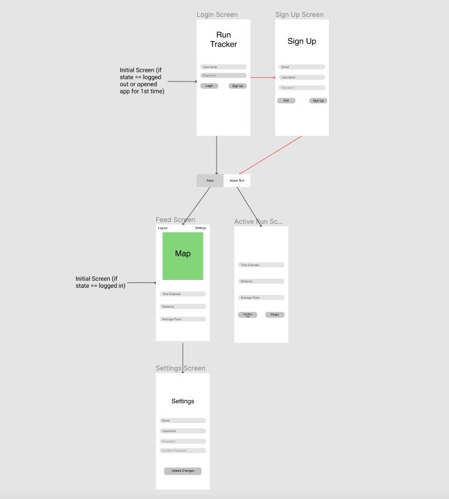

Original App Design Project - README Template
===

# Run Track Application

## Table of Contents
1. [Overview](#Overview)
1. [Product Spec](#Product-Spec)
1. [Wireframes](#Wireframes)
2. [Schema](#Schema)

## Overview
### Description
Application to track a user's run and collects information like the run distance, time elapsed, average speed. The user will create an account and has options like staying logged in and registering with an email. There will also be a way to show the user's run on a map. The application will have a home page with various tabs to let the user select what they want to do next.

### App Evaluation
- **Category: Health and Fitness**
- **Mobile: iPhone 12**
- **Story: We decided to make this application to allow users to track their runs. As a runner, I wanted an alternative to Strava and to experiment with iOS development**
- **Market: People of all ages and levels that enjoy running.**
- **Habit: Used on an ad hoc basis. Depends on when the user goes for a run**
- **Scope: Pertains to individual users as opposed to businesses.**

## Product Spec

### 1. User Stories (Required and Optional)

**Required Must-have Stories**

* User can create a new account
* User can login
* Managing the backend with Parse
* User can view run information on the home page dashboard
* User can track their current run on the active run page
* Active run page

**Optional Nice-to-have Stories**

* User can add friends

### 2. Screen Archetypes

* Login Screen
   * If the user has an account, then they can enter their username and password to login
   * If the user does not have an account, then they are redirected to the sign up screen and can create an account
* Sign Up Screen
   * On the sign in screen, the user enters their email, username, and password
   * They can either create the account or cancel
* Feed Screen
   * The feed screen shows a map, time elapsed, distance, and pace for past user runs
   * There is also a settings button for the user to go and change their information
* Active Run Screen
   * The active run screen shows a map, time elapsed, distance, and pace for the user's current run
   * The active run screen also includes a button for the user to start and stop their run
* Settings Screen
   * On the setttings screen, the user has the option to update their username, email, or password

### 3. Navigation

**Tab Navigation** (Tab to Screen)

* Feed Screen
* Active Run Screen

**Flow Navigation** (Screen to Screen)

* Login Screen
   * First, the user is presented with the login screen they will be instructed to enter their username and password or sign up for an account.
   * For users that have a pre-existing account, they will be directed to the feed screen.
   * Feed Screen: shows the history of past user runs. The feed screen has a map and information about the run (time elapsed, distance, and average pace). The feed screen also has an option for the user to go to the settings page.
   * Active Run Screen: screen that is used when the user is currently on a run. On this screen, there is a map that shows the path of the user's run so far, time elapsed, distance, and average pace. There are also 2 buttons: start/stop (similar to pause/unpause) and finish (complete the run).
* Sign Up Screen
   * On the sign up screen, the user is prompted to sign up with their email. The user must also create a username and password.
   * The user has 2 buttons: exit (cancel the sign up) and sign up (create the account).
   * After signing up, the user will be directed to the feed screen.
* Settings
   * On the settings screen, the user can change their email, username, and password.
   * There are 3 text boxes for the options.
   * There is also a button for the user to update changes.
   * After making changes, the user will be directed back to the feed screen.

## Wireframes
[Add picture of your hand sketched wireframes in this section]


### [BONUS] Digital Wireframes & Mockups

### [BONUS] Interactive Prototype

## Schema
### Models
| Property      | Type     | Description |
| ------------- | -------- | ------------ |
| userId        | String   | unique id for the user (primary key) |
| username      | String   | username |
| password      | String   | hash of the user's password |
| email         | String   | user's email address |

### Networking
- Sign Up Screen
	- (Create/POST) Create user with Email, Username, and Hash of Password
      ```swift
      let query = PFQuery(className:"Post")
      query.whereKey("author", equalTo: currentUser)
      query.order(byDescending: "createdAt")
      query.findObjectsInBackground { (posts: [PFObject]?, error: Error?) in
         if let error = error { 
            print(error.localizedDescription)
         } else if let posts = posts {
            print("Successfully retrieved \(posts.count) posts.")
         // TODO: Do something with posts...
         }
      }
      ```
- Login Screen
	- (Read/GET) Query all user’s usernames to see if username exists. Then, query username’s password hash to see if the entered password’s hash matches up. If the hash matches, we can log the user in using the supplied input.
- Feed Screen
	- No network request made here. Displays user’s last run data, which is stored on the device. Since we are only storing the last run’s data, we simply overwrite the last run’s data values every time a new run is completed, and use the new run’s values for display.
- Active Run Screen
	- No parse requests made from this screen. This screen will need to contact the maps API, however, to display the active location of the runner. Somehow the time elapsed, distance, average pace, and JSONified map data will need to be stored to the device.
- Settings Screen
	- (Update/PUT) Update Email, Username, Password for logged in user

- [Create basic snippets for each Parse network request]
- No APIs are used - only Apple MapKit is used.